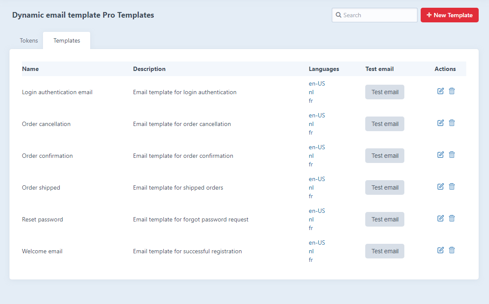
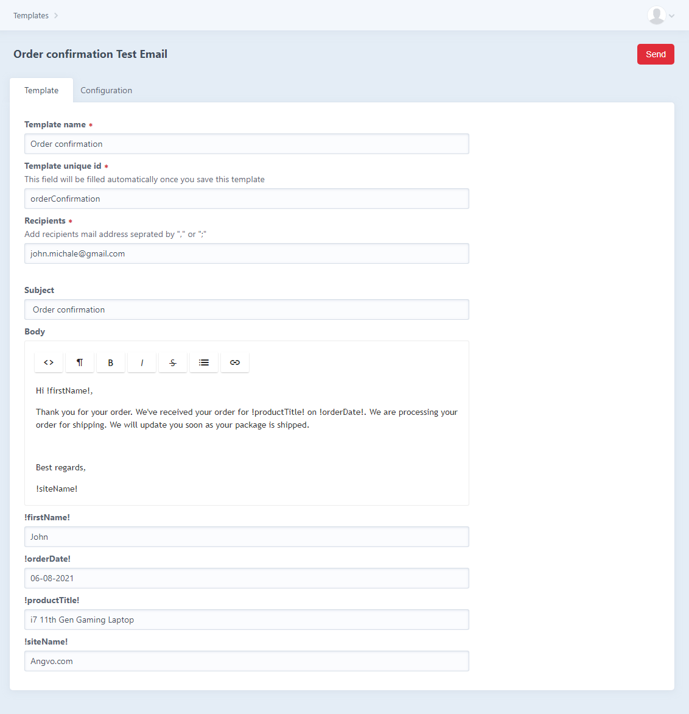
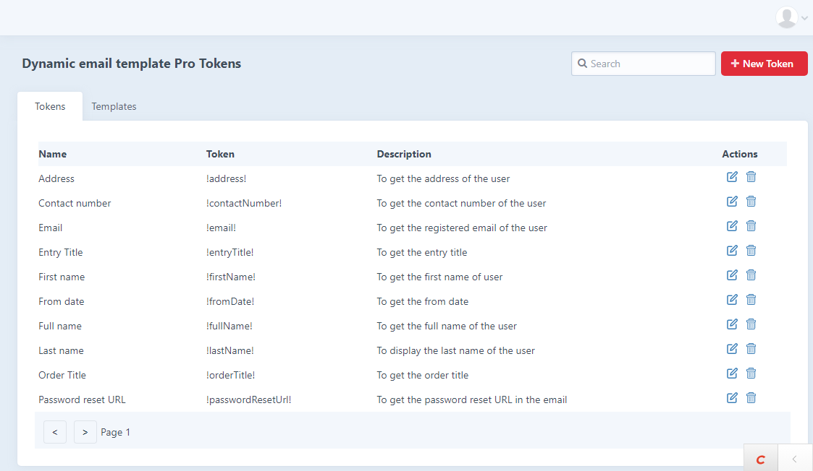
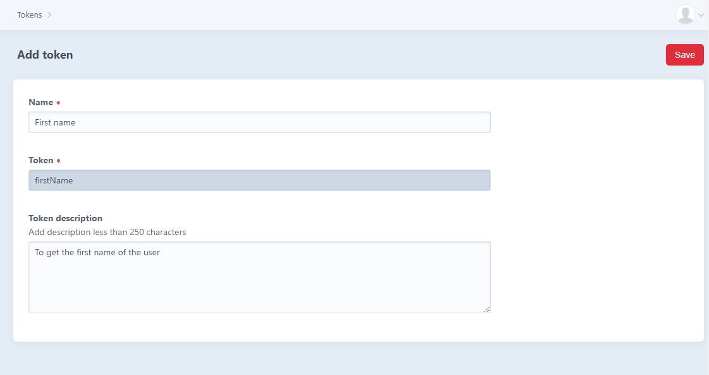
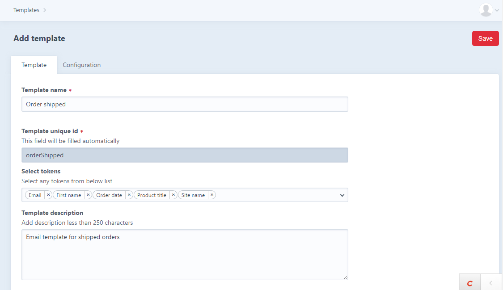
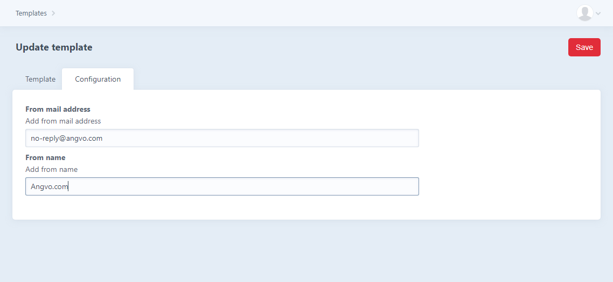
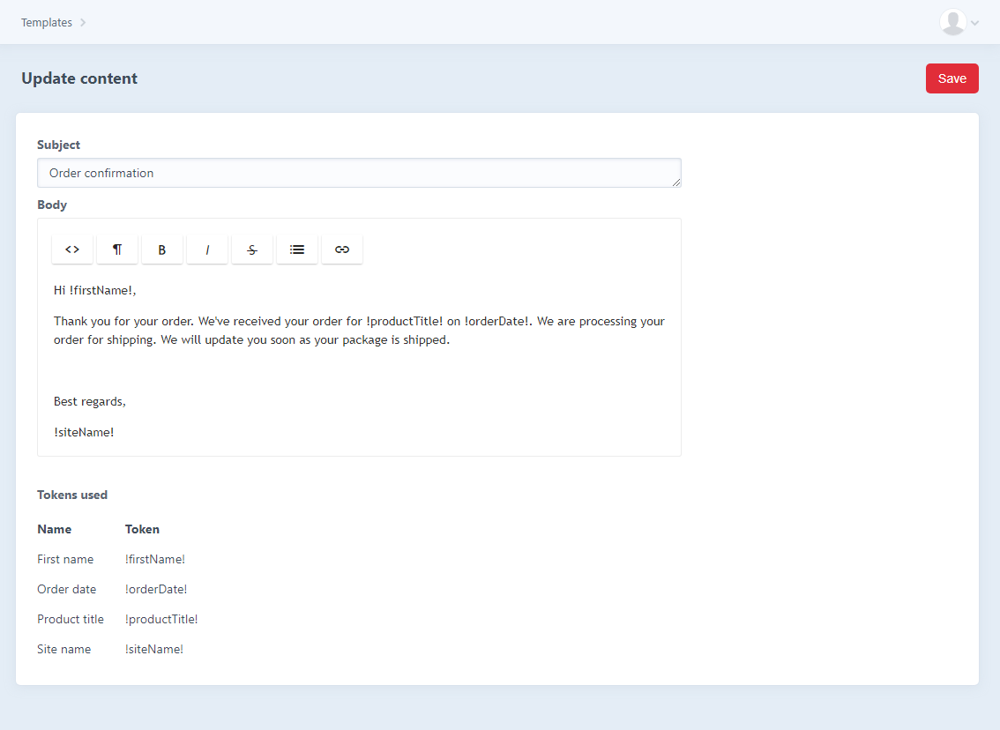
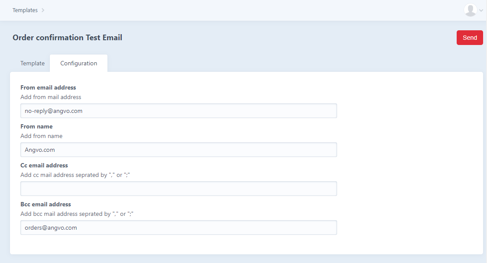
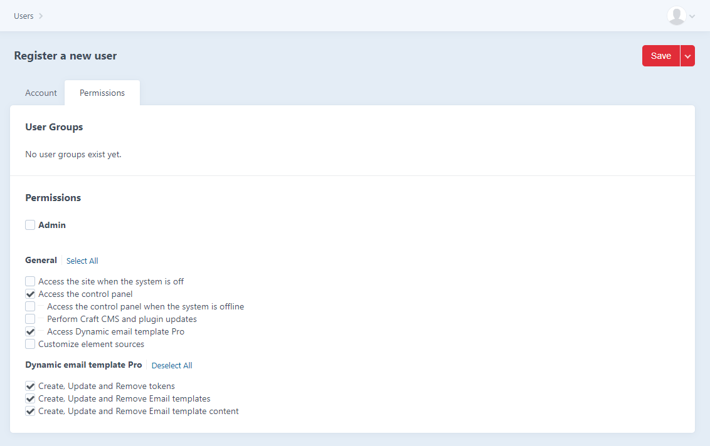

# Dynamic email template Pro plugin for Craft CMS 3.x

This plugin will have a control panel interface to create and manage your email templates and tokens in the database.

## Features

This module comes with the following features:

1. Create and manage tokens
2. Create and manage email templates
3. Send emails dynamically from your applications using tokens
4. Email personalization
5. Unlimited email templates and tokens
6. Define admin and user permissions 
7. Maintain each email template in multiple languages 
8. Cc and Bcc email configuration
9. Test email for email templates
10. A paginated overview of all the email templates and tokens with a search option

## Requirements

This plugin requires Craft CMS 3.5.0 or later.  
This plugin requires Craft CMS Redactor 2.0 or later.

## Installation

To install the plugin, follow these instructions.

1. Open your terminal and go to your Craft project:

        cd /path/to/project

2. Then tell Composer to load the plugin:

        composer require ip-craft/dynamic-email-template-pro

3. In the Control Panel, go to Settings → Plugins and click the “Install” button for Dynamic email template Pro.

After installation, you can edit your email templates in the control panel located at:
/admin/email-templates

## Steps to use the plugin after installing:

1. Manage tokens

   Once you installed the plugin, you will get this tokens screen where you can manage all your tokens. To create new token, click on the ‘+ New token’ button.

2. Create token

   This is the create token screen, here you can enter the token name and token description to brief what this token will do. 

3. Manage templates

   This is the email templates screen, where you can manage all your email templates. To create new template,  click on ‘+ New Template’ button.

4. Create template

   While adding template you can see two tabs 1. Template and 2. Configuration. In the template tab we can add the name of the template and select the tokens you need for email body composition.

      In the configuration tab, you can configure the From mail address and From name. 

5. Add email template body

   In this plugin you can add an email body in available site languages. To add the email body go to manage templates screen, click on language eg. ‘en-US’ and add your email. Here you can define the email subject, add email body and copy/paste the selected tokens in required places. 

6. Send test emails

   You can send the test emails from manage email template screen to check if email template is working as expected or not. 

7. User permissions

   You can define the required permissions to the user.

## How to use (Programatically):

Add the use statement to your class - use ipcraft\dynamicemailtemplatepro\DynamicEmailTemplatePro;

Access sendMail function and pass values Template unique id, Token value, Receivers, Reply to mail, Cc, Bcc, Attachments. As shown below -

// You can find Template unique id in email templates  
$templateId = ‘Template unique id’;

// Pass all the tokens and values you have added to template  
$tokens = {
“!token1!”:”token1 value”, 
“!token2!”:”token2 value”,
...
};

// Add receivers email address  
$receiver = [
Receiver 1 email address,
Receiver 1 email address,
...
 ];

// Add reply to email address  
$replyTo = ‘reply to mail address’;

// Add cc  email address  
$cc = [
Cc 1 email address,
Cc 2 email address,
...
 ];

// Add bcc  email address  
$bcc = [
Bcc 1 email address,
Bcc 2 email address,
...
 ];

// Add attachment to  email  
$attachments = ‘Give the file path’;
$emailService = EmailTemplates::$plugin->emailTemplatesService;
$emailService->sendMail($templateId, $tokens, $receiver, $replyTo, $cc, $bcc, $attachments);

 
Example : -  

use ipcraft\dynamicemailtemplatepro\DynamicEmailTemplatePro;
 
$templateId = 'userRegistrationTemplate';

$tokens = [
   "!Firstname!"=>"David",
   "!Lastname!"=>"Miller",
];

$receiver = [
        'david.miller@email.com'
];

$replyTo = 'contactme@email.com';

$cc = [
   'admin.contact@email.com',
   'hr.jhon@email.com'
]; 

$bcc = [
   'hr.manager@email.com',
   'team.manage@email.com'
];

$attachments = '{domain name}/assets/documents/invoice/invoice.pdf';

$emailService = DynamicEmailTemplatePro::$plugin->sendMailService;

$emailService->sendMail($templateId, $tokens, $receiver, $replyTo, $cc, $bcc, $attachments);

## Support

Get in touch with us via the mail [Dynamic email template Pro Support mail](mailto:support-craftplugins@infanion.com) or by [creating a Github issue](https://github.com/infanion-plugins/dynamic-email-template-pro/issues)

## Roadmap

Some things to do, and ideas for potential features:

* Resend sent email
* View sent emails
* Import and export email templates and tokens

Brought to you by [Infanion](https://www.infanion.com/)

